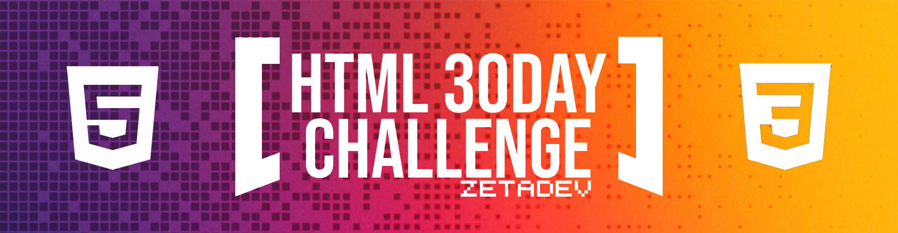

# 🖥️ HTML 30-DAY Challenge 🖥️
#### *[Aprendiendo HTML y CSS!]*

> #### *30 días de retos con Manz* 🎯 **[Manz 30-Day Challenge](https://lenguajehtml.com/challenge/)**

### Landing page con los retos resueltos: 🚀 **[My Landing Page](https://zetared92.github.io/HTML_30Day_Challenge/)** *[EN PROCESO]*

### **Los retos:**
* **01** - *Reto 01 | Fácil | [[Día 01](https://github.com/ZetaRed92/HTML_30Day_Challenge/tree/main/Retos/Reto%2001)]*
* **02** - *Reto 02 | Fácil | [[Día 02](https://github.com/ZetaRed92/HTML_30Day_Challenge/tree/main/Retos/Reto%2002)]*
* **03** - *Reto 03 | Fácil | [[Día 03](https://github.com/ZetaRed92/HTML_30Day_Challenge/tree/main/Retos/Reto%2003)]*
* **04** - *Reto 04 | Media | [[Día 04](https://github.com/ZetaRed92/HTML_30Day_Challenge/tree/main/Retos/Reto%2004)]*
* **05** - *Reto 05 | Fácil | [[Día 05](https://github.com/ZetaRed92/HTML_30Day_Challenge/tree/main/Retos/Reto%2005)]*
* **06** - *Reto 06 | Fácil | [[Día 06](https://github.com/ZetaRed92/HTML_30Day_Challenge/tree/main/Retos/Reto%2006)]*
* **07** - *Reto 07 | Media | [[Día 07](https://github.com/ZetaRed92/HTML_30Day_Challenge/tree/main/Retos/Reto%2007)]*